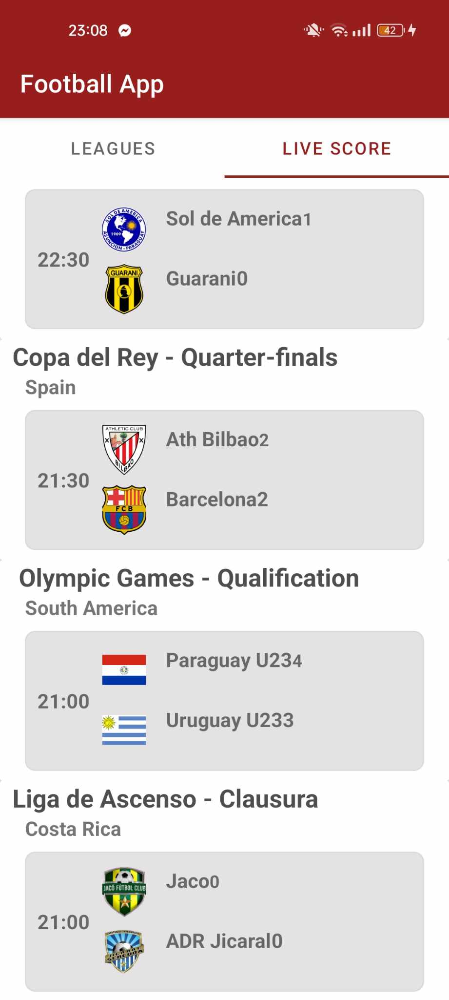
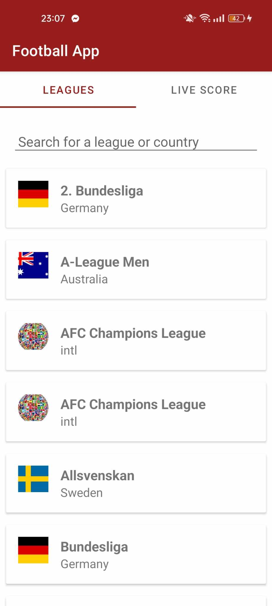
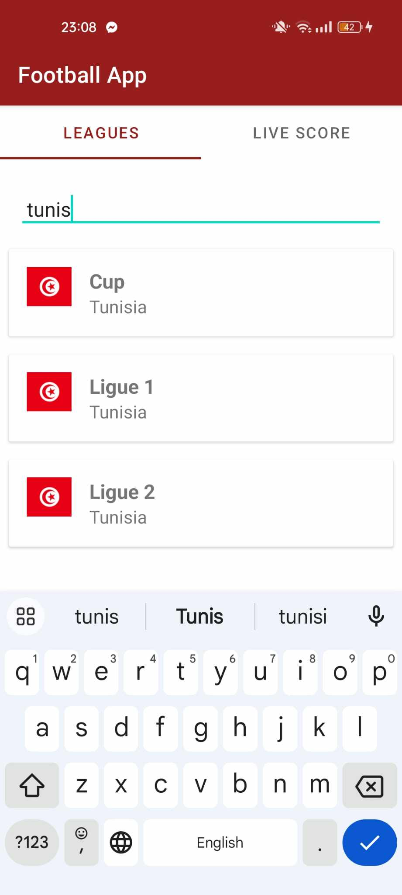
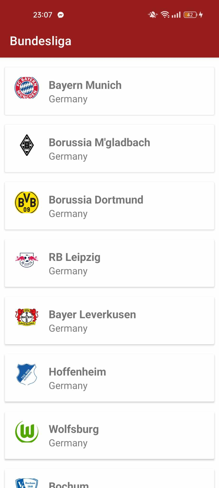
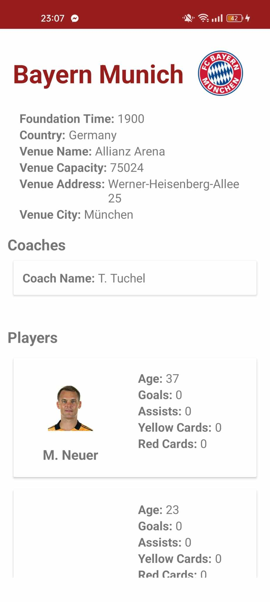

# Football Stats App

The Football Stats App is a mobile application that brings you real-time updates on football leagues, teams, and players. Stay informed with live scores, explore league details, team profiles, and player achievements.  The app is designed for easy navigation, providing an enjoyable experience for both casual fans and dedicated enthusiasts. Whether you're interested in match highlights or player statistics, the Football Stats App has you covered.
# Table of Contents

- [Features](#features)
  
- [Technologies Used](#technologies)
  
- [Architecture](#architecture)
  
- [Getting Started](#getting-started)
  
- [API Overview](#api)
  
- [Documentation](#documentation)

<!--- TODO : add screenshots --->
## Features 

1.  **Real-Time Match Updates**: Stay up-to-date with live scores, minute-by-minute commentary, and key moments of the game, ensuring you never miss a thrilling moment.
  
2. **League Information**:  Explore detailed information about various football leagues worldwide in a clean and organized manner. Utilize the search bar to filter leagues by country and name. Clicking on a league navigates to its details, providing a comprehensive overview.

3. **League's team list**:  Dive deep into team profiles to gain a comprehensive understanding of each team's history, achievements, and current standings within their respective leagues.

4. **Player Profiles and Team Details**:Discover detailed player profiles, including career statistics, personal achievements, and the latest news. Access the list of players by clicking on a specific team, providing in-depth insights into the team's roster and player details.

## Technologies Used 

- **Android Studio**: The official IDE for Android development, providing a powerful and intuitive environment for building and testing the Football Explorer App.

- **Retrofit**:  A type-safe HTTP client for Android and Java, facilitates seamless communication with the backend API, enhancing the app's responsiveness and data retrieval.

- **Interceptor for API Calls**: Enhances API communication by intercepting and modifying requests and responses, ensuring real-time match updates.
 
- **Fragments**: Creates modular and reusable UI components for enhanced application structure and user experience.
  
- **RecyclerView**: Efficiently displays lists of data, optimizing memory usage and providing a smooth scrolling experience.

## Architecture <a name="architecture">

The Football Stats App follows the Model-View-ViewModel (MVVM) architectural pattern ensuring a clean separation of concerns for modular development, easy testing, and maintainability. :

- **Model**: Data classes representing entities such as leagues, teams, and players.
  
- **View**: Fragments and activities responsible for displaying UI components.
  
- **ViewModel**: Manages the UI-related data and communicates with the underlying data layer.

## Getting Started 

To get started with the Football Stats App, follow these steps:

1. Clone the repository to your local machine using `git clone`.

2. Open the project in Android Studio.

3. Build and run the app on an emulator or physical device.

## API Overview 

https://apifootball.com/

The Football Explorer App relies on a RESTful API, to fetch real-time data, including live scores, player statistics, and match updates. The API follows industry best practices for secure and efficient communication.

## Documentation 

- [**Android Developers Guide**](https://developer.android.com/): Comprehensive set of documentation, resources, and tools provided for developers to create and enhance Android applications.
  
- [**Retrofit Documentation**](https://square.github.io/retrofit/): The official documentation and hub for Retrofit, facilitating efficient communication with RESTful APIs in Android applications.
  
- [**API Football Documentation**](https://apifootball.com/): Essential recources on API endpoints, request formats, and authentication methods, facilitating the seamless integration of comprehensive football-related data into the application.
